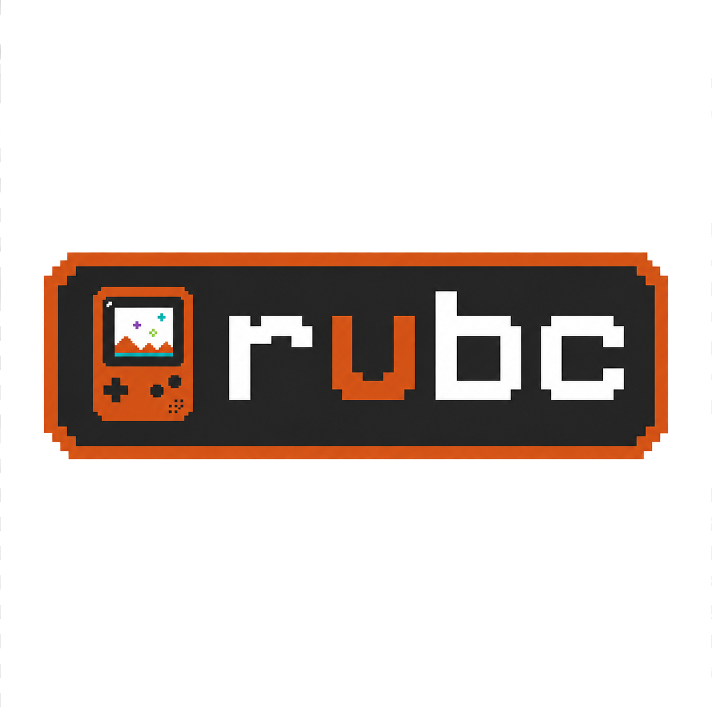
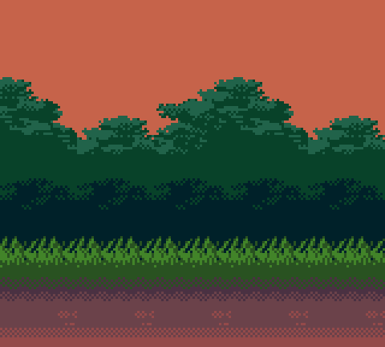
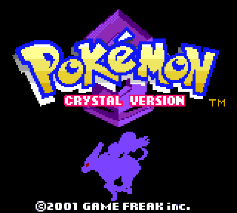

<div align="center">

<picture>
  <source media="(prefers-color-scheme: dark)" srcset="docs/media/rubc-light.png">
  
</picture>

### A cycle-accurate Game Boy and Game Boy Color emulator, written in safe Rust.

[](#building)
[](#why-rubc)
[](#accuracy)
[](#license)

<p>
  
  &nbsp;
  
</p>

*Pokémon Crystal running on rubc — color, sound, saves, and all.*

</div>

---

## What is rubc?

rubc is a Game Boy (DMG) and Game Boy Color (CGB) emulator that aims for one
thing above all: **getting the hardware right.** It runs your games with
accurate color, audio, battery saves, and the same subtle timing quirks the
original silicon had — verified against the industry-standard hardware test
suites.

It's small, fast, dependency-light, and written entirely in safe Rust.

## Features

- 🎮 **Plays DMG & CGB games** — full Game Boy and Game Boy Color support, with
  automatic detection from the cartridge header.
- 🌈 **Accurate color** — CGB palettes, per-tile attributes, and color mixing,
  pixel-exact on the `cgb-acid2` reference test.
- 🔊 **Real sound** — all four audio channels (two pulse, wave, noise) with the
  full envelope/sweep/length hardware, output through your speakers.
- 💾 **Battery saves** — games like Pokémon Crystal write a `.sav` file next to
  the ROM and resume right where you left off.
- ⏱️ **Cycle accuracy** — a per-T-cycle CPU driving T-cycle-accurate
  peripherals; passes Blargg's `instr_timing`, `mem_timing`, and the bulk of
  Gekkio's mooneye acceptance suite (94/115).
- 🧩 **Multiple cartridge types** — MBC0, MBC1, MBC2, MBC3 (with RTC), and MBC5.
- 🦀 **100% safe Rust** — the emulation core is `#![forbid(unsafe_code)]` with no
  C bindings, no `-sys` crates, and no FFI.

## Quick start

You'll need a recent stable [Rust toolchain](https://rustup.rs).

```sh
# Clone and build
git clone https://github.com/duysqubix/rubc.git
cd rubc
cargo build --release

# Play a game
cargo run --release -p rubc -- run path/to/game.gbc
```

That's it — a window opens and your game runs.

### Play in your browser (WebAssembly)

rubc compiles to WebAssembly and runs entirely client-side — your ROM never
leaves your machine. Build the bundle and serve it:

```sh
rustup target add wasm32-unknown-unknown
cargo install wasm-pack        # or: cargo install wasm-bindgen-cli --version 0.2.91

just wasm-build                # -> rubc-wasm/web/pkg/
just wasm-serve                # http://localhost:8000/
```

Open <http://localhost:8000/>, click **Load ROM**, and play.

### Play in your browser (Docker)

No Rust toolchain needed — just Docker. This builds the wasm bundle and serves
the demo through nginx:

```sh
docker compose up --build      # then open http://localhost:8080/
```

See the [**usage guide**](docs/USAGE.md) for the full walkthrough of all three
ways to run rubc (native, browser, Docker), saves, and troubleshooting.

## Controls

| Key | Game Boy button |
|-----|-----------------|
| Arrow keys | D-pad |
| <kbd>X</kbd> | A |
| <kbd>Z</kbd> | B |
| <kbd>Enter</kbd> | Start |
| <kbd>Right Shift</kbd> / <kbd>Backspace</kbd> | Select |
| <kbd>Esc</kbd> | Quit |

Run `rubc controls` any time to print this mapping.

## Saves

Cartridges with battery-backed RAM (most RPGs and save-capable games) persist to
a `.sav` file alongside the ROM — e.g. `crystal.gbc` saves to `crystal.sav`. The
file is written when you quit and periodically while you play, so an in-game save
survives closing the emulator. Drop in an existing `.sav` from another emulator
and rubc will pick it up on boot.

## Accuracy

rubc is developed test-first against real Game Boy hardware test ROMs. Here's
what currently passes:

| Suite | Result |
|-------|--------|
| **Blargg `cpu_instrs`** | ✅ 11/11 |
| **Blargg `instr_timing`** | ✅ Pass |
| **Blargg `mem_timing` / `mem_timing-2`** | ✅ Pass |
| **Blargg `halt_bug`** | ✅ Pass |
| **Blargg `dmg_sound`** | ✅ 12/12 |
| **Blargg `cgb_sound`** | ✅ 12/12 |
| **dmg-acid2** | ✅ Pixel-exact |
| **cgb-acid2** | ✅ Pixel-exact |
| **Mooneye acceptance (DMG-ABC + CGB)** | ✅ 94/115 |

### Test gallery

A picture is worth a thousand passing assertions. Each of these is rubc's own
rendered output running the named test ROM to completion:

<table>
  <tr>
    <td align="center"><br><sub>cpu_instrs</sub></td>
    <td align="center"><br><sub>instr_timing</sub></td>
    <td align="center"><br><sub>mem_timing</sub></td>
  </tr>
  <tr>
    <td align="center"><br><sub>dmg_sound</sub></td>
    <td align="center"><br><sub>cgb_sound</sub></td>
    <td align="center"><br><sub>halt_bug</sub></td>
  </tr>
  <tr>
    <td align="center"><br><sub>dmg-acid2</sub></td>
    <td align="center"><br><sub>cgb-acid2</sub></td>
    <td align="center"><br><sub>cgb-acid-hell</sub></td>
  </tr>
</table>

> The full per-ROM breakdown lives in [docs/ACCURACY.md](docs/ACCURACY.md).

## Why rubc?

- **Correctness first.** Every subsystem is gated against a real hardware test
  ROM before it's considered done. The CPU advances one M-cycle at a time, ticking
  four T-cycles internally; memory access is observable at individual T-cycles
  within each M-cycle (reads latch at end-T4, writes drive at per-register T-positions),
  ensuring memory and timer ordering matches the real machine.
- **DMG + CGB from the ground up.** Dual-mode is a first-class design target, not
  a retrofit — color, double-speed, VRAM/WRAM banking, and HDMA are all native.
- **Genuinely safe.** The core library forbids `unsafe`. No C dependencies means
  it builds anywhere Rust does, with no system libraries to chase.
- **Hackable.** A feature-gated diagnostics layer (flight recorder, BGB-format
  trace, state hashing, snapshots) makes hard timing bugs reconstructable from
  artifacts alone — and compiles to nothing when disabled.

## Building

```sh
cargo build --release          # optimized build
cargo run -p rubc -- run ROM   # build + run a ROM
cargo run -p rubc -- controls  # print the control mapping
cargo run -p rubc -- cartdump ROM   # inspect a cartridge header
```

[`just`](https://github.com/casey/just) recipes wrap the common workflows:

```sh
just run path/to/game.gb    # run quietly
just trun path/to/game.gb   # run with debug logging
just unit-test              # core unit tests
just wasm-build             # build the browser (WebAssembly) bundle
just check                  # fmt + clippy + build + test
```

## Project layout

```
rubc/
├── rubc-core/   # the emulator library — CPU, PPU, APU, bus, MBCs (no rendering)
│   └── src/
│       ├── cpu/       # SM83 core: per-T-cycle engine, all 512 opcodes, ALU
│       ├── bus/       # memory bus, PPU, APU, timer, cartridge/MBC banking
│       └── machine.rs # bootable Machine{Cpu, Bus} + test-ROM harness
├── rubc/        # the binary — windowing, rendering, audio, input
├── rubc-wasm/    # WebAssembly bindings + browser demo (web/)
├── deploy/       # nginx config for the Docker demo
└── justfile     # build / run / test / diagnostics recipes
```

The CPU and bus are joined by a single `CpuBus` trait: the CPU borrows the bus
`&mut` for each M-cycle of work. No peripheral holds a back-reference,
which keeps the whole design borrow-checker-clean and free of interior-mutability
hacks.

## Status

rubc plays commercial DMG and CGB games today, with picture, sound, input, and
battery saves — natively, in the browser (WebAssembly), or via Docker. Work
continues on the last few sub-instruction PPU timing edge cases (the mid-
scanline mealybug-tearoom and `cgb-acid-hell` tests).

## License

Released under the MIT License. See [LICENSE](LICENSE).

Game Boy is a trademark of Nintendo. rubc is an independent project and is not
affiliated with or endorsed by Nintendo.
