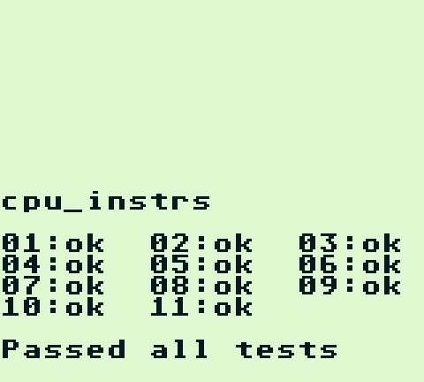
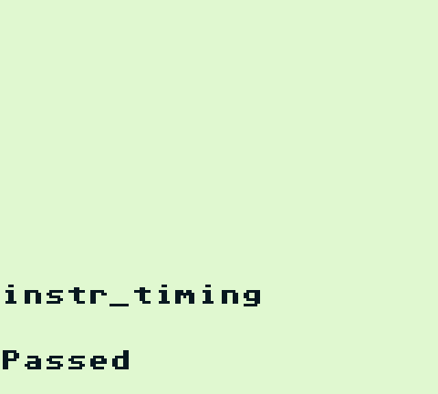
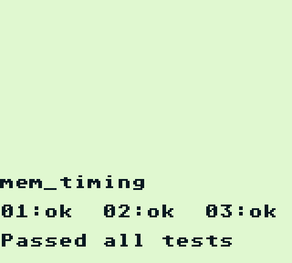
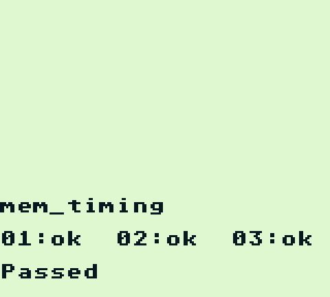
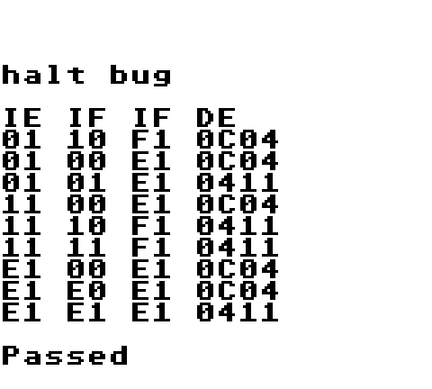
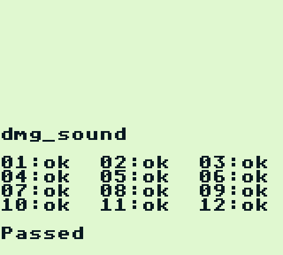
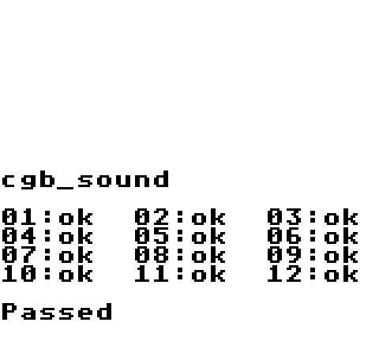
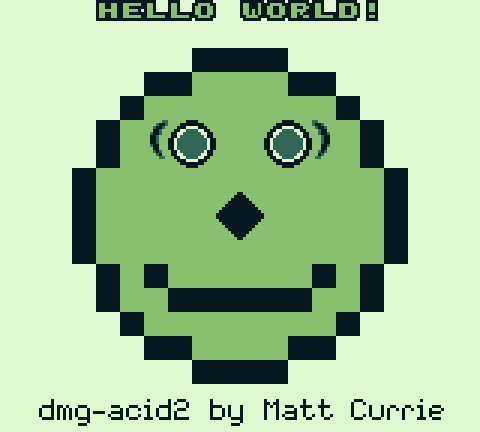
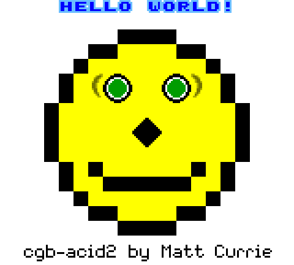
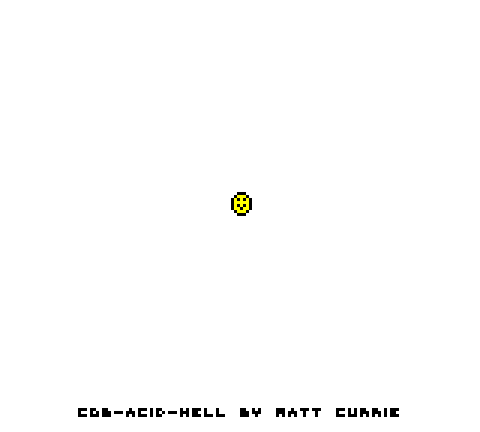

# Accuracy

rubc is built test-first against the standard Game Boy hardware test suites.
This page tracks the current per-ROM results. Everything here is reproducible —
the commands to run each suite are in the [justfile](../justfile).

## Blargg `gb-test-roms`

| ROM | Result |
|-----|--------|
| `cpu_instrs` (01–11) | ✅ 11/11 |
| `instr_timing` | ✅ Pass |
| `mem_timing` | ✅ Pass |
| `mem_timing-2` | ✅ Pass |
| `halt_bug` | ✅ Pass |
| `interrupt_time` (CGB) | ✅ Pass |
| `dmg_sound` (01–12) | ✅ 12/12 |
| `cgb_sound` (01–12) | ✅ 12/12 |
| `oam_bug` | ◐ 6/8 sub-tests (DMG OAM corruption — POP/RET patterns in progress) |

rubc's own rendered output running each suite to completion:

<table>
  <tr>
    <td align="center"><br><sub>cpu_instrs</sub></td>
    <td align="center"><br><sub>instr_timing</sub></td>
    <td align="center"><br><sub>mem_timing</sub></td>
  </tr>
  <tr>
    <td align="center"><br><sub>mem_timing-2</sub></td>
    <td align="center"><br><sub>halt_bug</sub></td>
    <td align="center"><br><sub>dmg_sound</sub></td>
  </tr>
  <tr>
    <td align="center"><br><sub>cgb_sound</sub></td>
    <td></td>
    <td></td>
  </tr>
</table>
## Visual / PPU reference tests

| Test | Result |
|------|--------|
| `dmg-acid2` | ✅ Pixel-exact (0/23040) |
| `cgb-acid2` | ✅ Pixel-exact (0/23040) |
| `cgb-acid-hell` | ◐ 23038/23040 (two-pixel mid-scanline scroll edge) |
| `mealybug-tearoom` | 🚧 mid-mode-3 register-write timing in progress |

<table>
  <tr>
    <td align="center"><br><sub>dmg-acid2 — pixel-exact</sub></td>
    <td align="center"><br><sub>cgb-acid2 — pixel-exact</sub></td>
    <td align="center"><br><sub>cgb-acid-hell — 23038/23040</sub></td>
  </tr>
</table>
## Mooneye acceptance (`mooneye-test-suite`)

**93 / 115** overall, targeting **DMG revisions A/B/C** and **Game Boy Color**.

| Category | Result |
|----------|--------|
| `acceptance/timer` | ✅ 13/13 |
| `acceptance/ppu` | ✅ 12/12 |
| `acceptance/oam_dma` | ✅ 6/6 |
| `acceptance/bits` | ✅ 3/3 |
| `acceptance/interrupts`, EI/DI/HALT timing | ✅ Pass |
| `acceptance/instr/daa` | ✅ Pass |
| Control-flow timing (`call`/`ret`/`push`/`pop`/`rst`/`jp`/`add_sp`/`ld_hl_sp`) | ✅ Pass |
| `emulator-only/mbc1` | ✅ 12/13 (multicart variant excluded) |
| `emulator-only/mbc2` | ✅ 7/7 |
| `emulator-only/mbc5` | ✅ 8/8 |

### About the 22 remaining mooneye tests

The remaining failures are **not** accuracy bugs for the hardware rubc targets;
they fall into three groups:

1. **Model-exclusive boot tests** (~16). Mooneye ships the same test compiled for
   every Game Boy revision (`dmg0`, `dmgABC`, `mgb`, `sgb`, `sgb2`, `A`, `cgb0`,
   `cgbABCDE`, …), and each revision has *different* correct boot-time register,
   `DIV`, and hardware-register values. A single emulator can only match one
   revision per family. rubc emulates **DMG-ABC** and **CGB**, and passes exactly
   those variants (`boot_regs-dmgABC`, `boot_regs-cgb`). Passing, say, the `mgb`
   variant would by definition break the `dmgABC` one.
2. **CGB sub-revision register reads** (`unused_hwio-C`). This test expects
   `KEY1`/`RP`/`OPRI`/`SVBK` to read as unmapped — but those are functional CGB
   registers rubc implements correctly. Matching the test would break real CGB
   games.
3. **Out-of-scope features**: link-cable serial timing, the MBC1 multicart
   wiring variant, and utility/manual/torture ROMs (`bootrom_dumper`,
   `sprite_priority`, the `madness` category).

## Reproducing

```sh
# Blargg
just regression-test                    # cpu_instrs via serial

# Mooneye (requires WLA-DX: brew install wla-dx)
just mooneye-build
just mooneye 'acceptance/timer'         # any glob
just mooneye-report                     # whole-suite pass/fail

# Visual tests (references vendored under reference/)
just acid2
```
